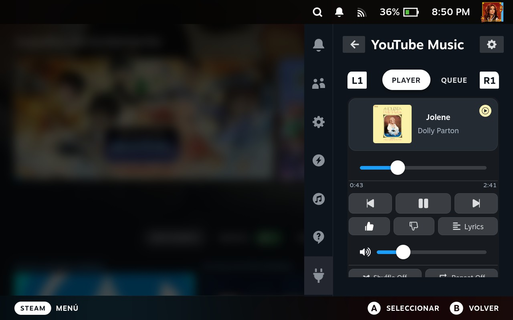
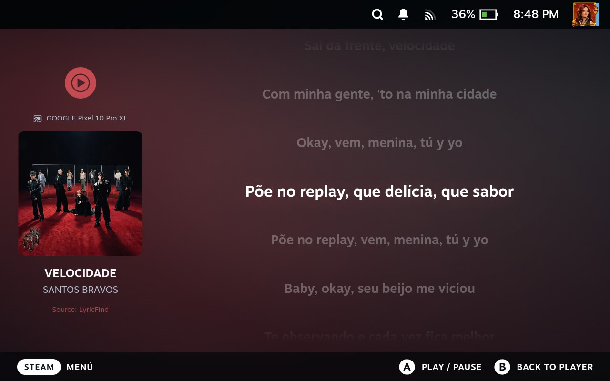
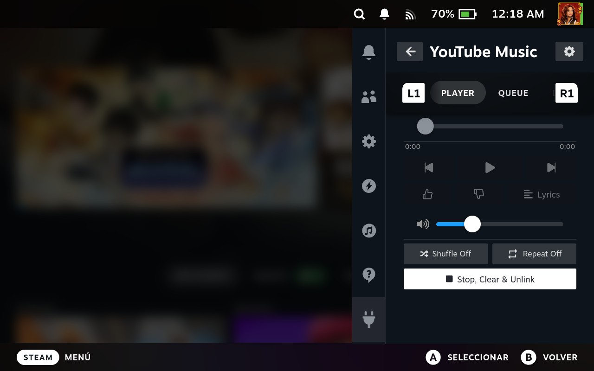
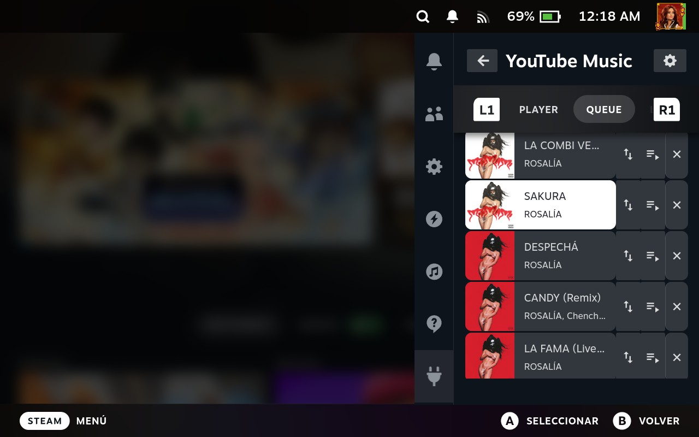
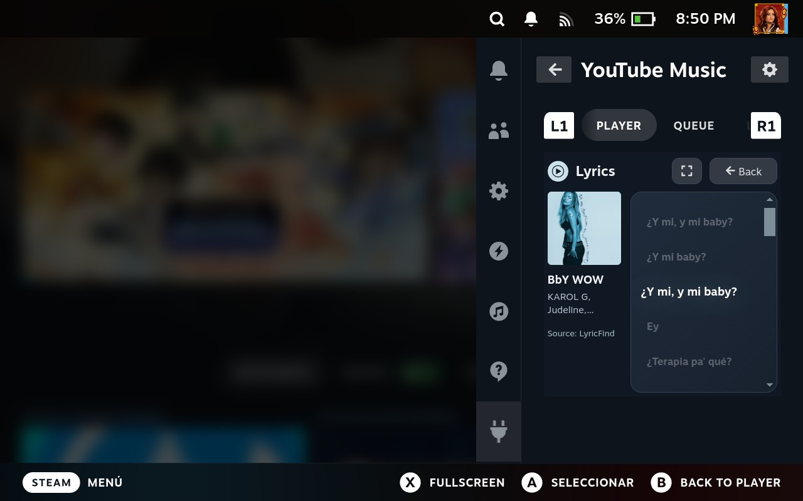

# YouTube Music Unified for Decky Loader

A Steam Deck plugin that plays YouTube Music from Quick Access and turns the Deck into a YouTube Cast receiver. It combines local playback, queue, library, lyrics, controller-friendly controls, notifications, and Cast discovery on trusted networks.

The current stable version is **0.6.1**. Most users should install the ZIP attached to a Release.

## Features

- Play YouTube Music songs and playlists, with direct videoId search playback.
- Queue controls: previous, next, remove, reorder, and Play next.
- Local playback and YouTube / YouTube Music Cast session receiving.
- Cast discovery restricted to networks marked as trusted.
- Configurable Cast receiver name.
- Lyrics navigation with the D-pad and L1/R1 page controls.
- Gamepad-controlled progress and volume sliders.
- Like/dislike, shuffle, repeat, and playlist library.
- Native Decky notifications for device connections and song changes. Each notification and sound is configurable separately; sounds are disabled by default.
- Stop, Clear & Unlink stops audio, clears the queue, and ends the active Cast session.

## Screenshots











## Quick installation

1. Download `youtube-music-unified-0.6.1.zip` from **Releases**.
2. In Gaming Mode, open Decky → Developer Options → **Install from ZIP**.
3. Select the ZIP and restart Decky if the previous version is still shown.
4. Configure authentication in **Settings → Account**.

The `-source` ZIP is intended for development.

## Authentication

The plugin uses browser request headers from an active YouTube Music session. It never stores your Google password. The exported file contains session cookies, so keep it private and never commit it to GitHub.

### Step 1: Export the headers

1. On your PC, open a browser, go to `https://music.youtube.com`, and sign in.
2. Open Developer Tools with **F12**, then select the **Network** tab.
3. Click around YouTube Music (opening **Library** is a reliable way to generate the request).
4. Find a successful **POST** request to `/browse` with status **200**.
5. Copy the request headers:
   - **Firefox:** right-click the request → **Copy → Copy Request Headers**.
   - **Chrome/Edge:** open the request, find **Request Headers**, and copy the headers starting at `accept: */*`.
6. Paste the result into a plain-text file named exactly **`yt-music-headers.txt`**. Do not add Markdown formatting or remove the `cookie:` header.

### Step 2: Transfer the file to the Deck

Copy `yt-music-headers.txt` to `/home/deck/`. You can use a USB drive, file sharing, or SSH/SCP:

```bash
scp yt-music-headers.txt deck@steamdeck:/home/deck/yt-music-headers.txt
```

### Step 3: Connect the plugin

1. Open YouTube Music Unified in Decky and select the **gear** icon.
2. Open **Settings → Account**.
3. Enter `/home/deck/yt-music-headers.txt` as the headers path.
4. Select **Load & Connect** and wait for the **Authenticated** status.

If authentication expires, repeat the export and replace the file. Reinstalling the plugin is not required. Browser credentials commonly last a long time, but Google can invalidate them at any time.

## Cast setup

1. Open Settings → Cast Receiver.
2. Select **Trust this network** on the network you will use.
3. Change the receiver name if desired.
4. In YouTube or YouTube Music, choose the Deck from the Cast button.

Both devices must be on the same LAN. Client isolation, multicast filtering, and some mesh networks can prevent discovery.

## Queue and sender behavior

During Cast, the sender's queue is the initial source. From Queue, you can move a track or mark it as next. The receiver keeps that order while advancing, going back, or finishing a song. A new queue sent by the sender replaces the local order. Some apps may continue showing their original order because the protocol does not provide a portable queue-write operation.

## Notifications

Settings → Notifications provides independent switches for **Device connected**, **Connection sound**, **Now playing**, and **Song change sound**. Notifications use Decky's native Steam UI, include the device name or album art/title/artist, and work with Quick Access closed. They do not add a polling process or duplicate pause/resume alerts.

## Build on Windows

Requirements: Node.js, pnpm, Python, and PowerShell.

```powershell
pnpm install
pnpm run build
pnpm run build:backend
pnpm run package
```

`build.ps1` installs `ytmusicapi` into `py_modules/` and downloads Linux Node.js and yt-dlp binaries when missing. Run tests with:

```powershell
pnpm test
pnpm run test:python
```

The package uses this Decky-compatible layout:

```text
YouTube Music/
  main.py
  package.json
  plugin.json
  dist/index.js
  backend/out/server.cjs
  backend/xml/
  py_modules/
  bin/node
  bin/yt-dlp
```

## Architecture

- `src/`: React/TypeScript Quick Access interface.
- `src/services/audioManager.ts`: persistent audio, Cast WebSocket, progress, and events.
- `src/services/notifications.tsx`: notification preferences and native alerts.
- `main.py`: authentication, library, local playback, and local queue.
- `backend/src/`: Node Cast receiver and queue operations.
- `py_modules/`: vendored Python dependencies.
- `bin/`: Linux binaries included in the package.

## Origin and credits

This project combines and adapts ideas and code from:

- [decky-youtube-music-player](https://github.com/artistro08/decky-youtube-music-player): player, authentication, library, and controls.
- [youtube-cast-receiver](https://github.com/artistro08/youtube-cast-receiver): Cast receiver, especially [release v0.4.1](https://github.com/artistro08/youtube-cast-receiver/releases/tag/v0.4.1).
- [yt-cast-receiver](https://www.npmjs.com/package/yt-cast-receiver): Node implementation of the Cast protocol.
- [ytmusicapi](https://github.com/sigma67/ytmusicapi): unofficial YouTube Music client.
- [yt-dlp](https://github.com/yt-dlp/yt-dlp): stream extractor.

Project development and integration were completed with assistance from **Codex by ChatGPT**. **Google Gemini** was used as a secondary consultation resource.

This repository's implementation is released under BSD-3-Clause. Dependencies retain their own licenses. GitHub Actions runs typechecking, builds, and Python/Node tests on every push and pull request.

## Troubleshooting

**Not authenticated:** verify the path and export fresh `yt-music-headers.txt`.

**The Deck does not appear for Cast:** verify the same network, Trust this network, and router isolation/multicast settings.

**The queue returns to its previous order:** the sender sent a new queue update.

**Lyrics unavailable:** some songs do not provide lyrics.

## License

BSD-3-Clause. See [LICENSE](LICENSE).
