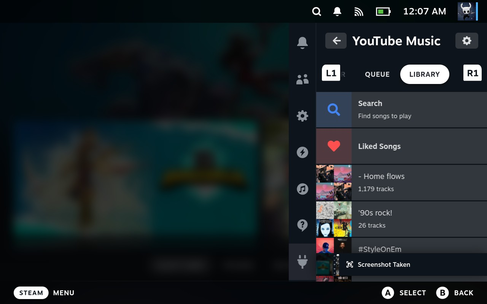

# YouTube Music Unified para Decky Loader

Plugin para Steam Deck que reproduce YouTube Music directamente desde Quick Access y convierte la Deck en un receptor de YouTube Cast. Integra reproductor local, cola, biblioteca, letras, controles con mando, notificaciones y descubrimiento Cast en redes de confianza.

La versión estable actual es **0.6.1**. Para la mayoría de usuarios se recomienda instalar el ZIP de un Release.

## Funciones

- Reproducción de canciones y playlists de YouTube Music.
- Búsqueda con reproducción directa por videoId.
- Cola con anterior/siguiente, eliminar, reordenar y Play next.
- Reproducción local y recepción de sesiones de YouTube/YouTube Music Cast.
- Descubrimiento Cast restringido a redes marcadas como confiables.
- Nombre del dispositivo Cast configurable.
- Letras con cruceta y páginas con L1/R1.
- Sliders de progreso y volumen controlables con mando.
- Like/dislike, shuffle, repeat y biblioteca de playlists.
- Notificaciones nativas de Decky al conectarse un dispositivo y cambiar la canción. Cada aviso y sonido se configura por separado; los sonidos vienen desactivados.
- Stop, Clear & Unlink detiene audio, vacía la cola y termina la sesión Cast actual.

## Vista




## Instalación rápida

1. Descarga `youtube-music-unified-0.6.1.zip` desde **Releases**.
2. En Gaming Mode abre Decky → Developer Options → **Install from ZIP**.
3. Selecciona el ZIP y reinicia Decky si la versión anterior todavía aparece.
4. Configura la autenticación en **Settings → Account**.

El ZIP `-source` es para desarrollo.

## Autenticación

El plugin usa headers de una sesión iniciada en YouTube Music. No guarda tu contraseña.

1. En una PC abre `music.youtube.com` e inicia sesión.
2. DevTools (F12) → Network: localiza una petición POST a `/browse` con estado 200.
3. Copia sus request headers a **`yt-music-headers.txt`**.
4. Transfiere el archivo a `/home/deck/`.
5. En Settings → Account introduce `/home/deck/yt-music-headers.txt` y pulsa **Load & Connect**.

Si la sesión expira, vuelve a exportar headers; no hace falta reinstalar el plugin.

## Cast

1. Abre Settings → Cast Receiver.
2. Pulsa **Trust this network** en la red que usarás.
3. Cambia el nombre del dispositivo si quieres.
4. En YouTube o YouTube Music elige la Deck desde el botón Cast.

Ambos dispositivos deben estar en la misma LAN. El aislamiento de clientes, filtros multicast o algunas redes mesh pueden impedir el descubrimiento.

## Cola y dispositivo emisor

Durante Cast, la cola recibida del emisor es la fuente inicial. Desde Queue puedes mover una pista o marcarla como siguiente. El receptor conserva ese orden al avanzar, retroceder o terminar la canción. Si el teléfono envía una cola nueva, esa actualización reemplaza el orden local. Algunas aplicaciones pueden seguir mostrando su orden original porque el protocolo no ofrece una operación portable para escribirlo.

Eliminar pistas Cast permanece en el emisor. Las colas con videoId duplicados también deben ordenarse allí.

## Notificaciones

En Settings → Notifications se configuran **Device connected**, **Connection sound**, **Now playing** y **Song change sound**. Usan el sistema nativo de Decky/Steam, incluyen nombre o portada/título/artista y funcionan con Quick Access cerrado. No añaden un proceso de sondeo. Pausa y reanudación no generan avisos duplicados.

## Compilar desde Windows

Requisitos: Node.js, pnpm y PowerShell.

```powershell
pnpm install
pnpm run build
pnpm run build:backend
pnpm run package
```

`build.ps1` instala `ytmusicapi` en `py_modules/` y descarga Node Linux y
yt-dlp standalone cuando faltan. Las pruebas:

```powershell
pnpm test
pnpm run test:python
```

El ZIP contiene la estructura compatible con Decky:

```text
YouTube Music/
  main.py
  package.json
  plugin.json
  dist/index.js
  backend/out/server.cjs
  backend/xml/
  py_modules/
  bin/node
  bin/yt-dlp
```

## Arquitectura

- `src/`: interfaz React/TypeScript de Quick Access.
- `src/services/audioManager.ts`: audio persistente, Cast WebSocket, progreso y eventos.
- `src/services/notifications.tsx`: preferencias y avisos nativos.
- `main.py`: autenticación, biblioteca, reproducción local y cola local.
- `backend/src/`: receptor Cast Node y operaciones de cola.
- `py_modules/`: dependencias Python vendorizadas.
- `bin/`: binarios Linux del paquete.

## Origen y créditos

Este proyecto combina y adapta ideas y código de:

- [decky-youtube-music-player](https://github.com/artistro08/decky-youtube-music-player): reproductor, autenticación, biblioteca y controles.
- [youtube-cast-receiver](https://github.com/artistro08/youtube-cast-receiver): receptor Cast, especialmente el release [v0.4.1](https://github.com/artistro08/youtube-cast-receiver/releases/tag/v0.4.1).
- [yt-cast-receiver](https://www.npmjs.com/package/yt-cast-receiver): biblioteca Node del protocolo Cast.
- [ytmusicapi](https://github.com/sigma67/ytmusicapi): cliente no oficial de YouTube Music.
- [yt-dlp](https://github.com/yt-dlp/yt-dlp): extractor de streams.

La implementación de este repositorio usa BSD-3-Clause. Las dependencias conservan sus propias licencias.

## Solución de problemas

**No autenticado:** comprueba la ruta y vuelve a exportar `yt-music-headers.txt`.

**La Deck no aparece para Cast:** comprueba misma red, Trust this network y aislamiento/multicast del router.

**La cola vuelve a su orden anterior:** el emisor envió una actualización nueva.

**Lyrics no disponibles:** algunas canciones no publican letras.

## Licencia

BSD-3-Clause. Consulta [LICENSE](LICENSE).
